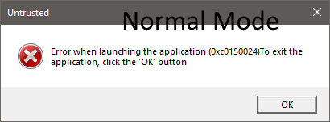
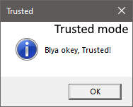

# Human Factor Exploitation Script

## Overview

The **Human Factor Exploitation Script** is designed to exploit the human tendency to trust actions that appear normal without requiring proof. The script consists of two main components:

1. `(un)truster.vbs`
2. `humanfactor.vbs`

## Components

### 1. `(un)truster.vbs`

The `(un)truster.vbs` component is responsible for setting the operational mode of `humanfactor.vbs`. It provides a simple interface for the user to choose between two modes:

- **Mode 0: Trust Mode Off (Real Mode)**
  - Selecting this option disables the trust mode, effectively turning off the human factor exploitation. In this mode, `humanfactor.vbs` operates in a straightforward, non-deceptive manner, potentially revealing its true intentions.

- **Mode 1: Trust Mode On (Exploitation Mode)**
  - Choosing this option activates the trust mode, enabling the exploitation of the human factor. In this mode, `humanfactor.vbs` operates under the guise of normalcy, performing its intended actions without raising suspicion.

#### Usage

To use `(un)truster.vbs`, simply run the script and select the desired mode:

- Enter `0` to disable trust mode.
- Enter `1` to enable trust mode.

The script will then configure `humanfactor.vbs` accordingly, ensuring it operates in the selected mode.

### 2. `humanfactor.vbs`

The `humanfactor.vbs` component is the core of the script, exploiting the trust established by `(un)truster.vbs`. It carries out the intended actions, which may include data exfiltration, system manipulation, or other harmful operations. The user is led to believe that everything is normal, thus bypassing suspicion.

## Usage

To use this script, follow these steps:

1. Download both `(un)truster.vbs` and `humanfactor.vbs` to your target system.
2. Execute `(un)truster.vbs` first to set the operational mode.
3. Once the mode is selected, execute `humanfactor.vbs` to perform the intended actions based on the chosen mode.

## MessageBoxes

#### Untrusted mode

#### Trusted mode

##### Actual only in this code

## Disclaimer

This script is intended for educational and research purposes only. The author does not condone or support the use of this script for any malicious activities. Use it responsibly and ethically.
